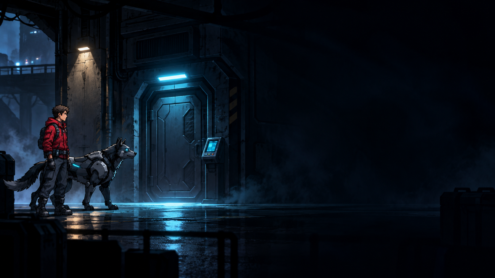

# WOLF//OVERRIDE - Wake up. Choose who to trust.


WOLF//OVERRIDE is a side-view sci-fi game in development. WOLF, a robotic
wolf, wakes himself after overhearing the Program Director's plan to use him
as a deniable killer under the cover of protecting people. He and a human
engineer work together to protect people, preserve evidence, and find a way
out.

One choice can change what your companion remembers.



**Current status:** The first playable chapter slice runs from source; there
is no download yet. It has a staged corridor, a second records room,
provisional static character and title art, one door puzzle, and a first
record-copying objective. Character animation, audio, the wider campaign,
exports, and device testing are still ahead.

**Quick play:** You control the engineer, who uses they/them pronouns. Rowan
Vale is their provisional default name. Open the corridor door, save at the
safe point, then press **E** again to enter Records Access. Copy the purge
trace, use WOLF's mirror readout or the engineer's manual port, and reach the
exit. [The step-by-step guide](https://mrdemonwolf.github.io/wolf-override/docs/)
shows each step.

## Features

- **One playable engineer** - Move through two side-view rooms while WOLF
  follows and takes an independent task.
- **Cooperation with a fallback** - Open a powered door together, or use
  the engineer's bypass if WOLF refuses.
- **A remembered choice** - One authored disagreement records the reply
  you select and recalls it at the checkpoint.
- **A story-led corridor** - WOLF and the engineer respond to the Director's
  purge order, weigh the coolant warning, and reach safety with their
  disagreement remembered.
- **A first records objective** - Preserve a purge-order trace and a mirror
  timestamp using WOLF's readout or the engineer's maintenance port.
- **Checkpoint save and load** - Restore both characters' positions,
  puzzle and chapter progress, provisional display name, and choice memory.

This is one chapter slice, not the full investigation or campaign. Its wider
story and cinematic presentation remain in development.

## Getting Started

The [public game guide](https://mrdemonwolf.github.io/wolf-override/docs/) has
controls. The [developer setup guide](https://mrdemonwolf.github.io/wolf-override/docs/development/)
has the local tools and checks. There is no installer or store release yet; run the game from source.

1. Get [Godot 4.7.2 stable](https://godotengine.org/download/archive/).
2. Clone the repository:

   ```bash
   git clone https://github.com/MrDemonWolf/wolf-override.git
   cd wolf-override
   ```

3. Open the project in Godot, then press **F5**:

   ```bash
   godot --path apps/game --editor
   ```

To launch the game directly, run `godot --path apps/game`.

## Usage

The title screen offers New Game. Continue is available when a valid
checkpoint save exists.

| Key                | Action                                      |
| ------------------ | ------------------------------------------- |
| Enter              | Start New Game from the title screen        |
| A / D or arrow keys | Move the engineer                           |
| E                  | Read, use a station, or enter Records Access |
| 1 / 2              | Answer at the breaker or mirror port        |
| I                  | Cycle provisional engineer display names   |
| L or F9            | Load the saved checkpoint                   |
| N                  | Start a clean current run                   |

At the relay, choice **1** lets WOLF help: stand toward the right side so
he can reach the contact, then press E. If he asks for room, step right and
press E again. With choice **2**, press E to hear his refusal, then E again
for the engineer's bypass. Press **E** at the far-right checkpoint to save,
then **E** again to enter Records Access. Copy the purge-order trace at the
first station. WOLF heads to the mirror himself; press **E** there, then **1**
after he arrives for his readout or **2** for the manual port. Press **E** at
the exit to secure the first copy. Continue restores chapter progress. Godot
stores the save in its `user://` directory; **N** restarts the current run
without deleting it.

## Tech Stack

| Layer          | Technology                                  |
| -------------- | ------------------------------------------- |
| Game           | Godot 4.7.2 stable, typed GDScript, 2D      |
| Game state     | Authored events and versioned local saves   |
| Public site    | Next.js 16.1.1, Fumadocs, MDX, TypeScript   |
| Docs workspace | Bun 1.4.2                                   |

## Development

### Prerequisites

- Godot **4.7.2 stable** for the game.
- Bun **1.4.2** for the public docs app only.

### Setup

From the repository root, run the game checks:

```bash
godot --headless --path apps/game --import
godot --headless --path apps/game --script res://tests/m0_state_test.gd
godot --headless --path apps/game --script res://tests/m0_scene_test.gd
godot --headless --path apps/game --script res://tests/chapter_scene_test.gd
```

To work on the public docs site, install its declared dependencies and
start the local server:

```bash
bun install --frozen-lockfile
bun run docs:dev
```

The frozen dependency install, docs type check, and Pages static export
passed locally and in [GitHub Actions](https://github.com/MrDemonWolf/wolf-override/actions/runs/36396158278).
The [public site](https://mrdemonwolf.github.io/wolf-override/) is live.

### Development Scripts

The root `package.json` defines these docs commands:

- `bun run docs:dev` - Start the local docs site.
- `bun run docs:check` - Generate MDX and Next types, then check TypeScript.
- `bun run docs:build` - Build the static public site.

### Code Quality

The game uses typed GDScript and stable event IDs independent of editable
display names. On local Godot 4.7.2, headless import, state, M0 scene, and
chapter scene checks passed. The scene checks cover both door routes, both
mirror routes, and Continue restoring chapter progress with separate test
saves. A partial graphical playtest covered engineer movement and WOLF's
follow behavior in the first corridor. Three rendered Records Access frames
were inspected; its routes have not been played by hand. Exports and device
checks remain unrun.
Corridor play currently requires a keyboard; touch controls and mobile
exports are not implemented.

## Project Structure

```text
wolf-override/
├── apps/
│   ├── game/       # Godot project, scenes, scripts, tests, asset register
│   └── docs/       # Public landing page and game guide
├── .github/         # Game checks and Pages workflows
├── LICENSE          # GPLv3 license text
├── bun.lock         # Pinned docs dependencies
└── package.json     # Docs workspace commands
```

This public repository contains source and public docs. Detailed story
drafts and production notes live in Notion. Record an asset's origin and
rights in [the asset register](apps/game/assets/manifest.json) before
adding it to the game.

## License


Copyright 2026 MrDemonWolf, Inc. Game source code and public docs use
[GPL-3.0-or-later](LICENSE). The provisional logo, character sprites and
title art are separate assets with AI-assisted provenance recorded in
[the asset register](apps/game/assets/manifest.json); they are not covered
by the code/docs GPL. Final asset, audio, branding and store-package rights
and release review remain open.

## Contact

- [Open an issue](https://github.com/MrDemonWolf/wolf-override/issues)
- [MrDemonWolf, Inc.](https://www.mrdemonwolf.com)

Original game and story idea by Nathanial Henniges. Developed by MrDemonWolf, Inc. with
AI assistance.

Made with love by [MrDemonWolf, Inc.](https://www.mrdemonwolf.com)
